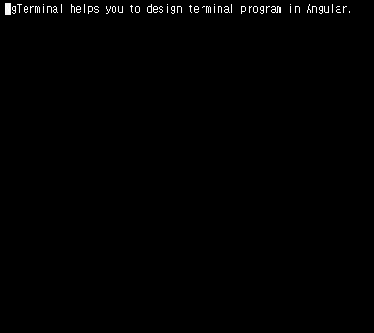

# NgTerminal

[](https://www.npmjs.com/package/ng-terminal)

NgTerminal is a interactive terminal component on Angular. `NgTerminal`'s buffer is simply controlled by `TerminalBuffer` object. 

This project contains a example and a core library.



## Install

```
npm install ng-terminal
```

## Example

You can run a sample project in your local environment.

1) git clone https://github.com/qwefgh90/ng-terminal.git
2) npm install
3) ng serve

#### Descriptions

Modules should be imported in `app.module.ts`.

```typescript
import { NgTerminalModule } from 'ng-terminal';
//your codes
@NgModule({
    imports: [
        NgTerminalModule
    //your codes
```

Implements your callback functions to your `app.component.ts`.

```typescript
import { TerminalBuffer, keyMap } from 'ng-terminal';
    //your codes

    public bf: TerminalBuffer;
    
    onInit(bf: TerminalBuffer) {
        this.bf = bf;
    }
    
    onKey(e: KeyboardEvent) {
        if (e.key == 'Enter') {
            this.bf.write(keyMap.Linefeed);
        } else if (e.key == 'Backspace') {
            this.bf.write(keyMap.BackSpace);
        } else if (e.key == 'ArrowLeft') {
            this.bf.write(keyMap.ArrowLeft);
        } else if (e.key == 'ArrowRight') {
            this.bf.write(keyMap.ArrowRight);
        } else if (e.key == 'ArrowUp') {
            this.bf.write(keyMap.ArrowUp);
        } else if (e.key == 'ArrowDown') {
            this.bf.write(keyMap.ArrowDown);
        } else if (e.key == 'Delete') {
            this.bf.write(keyMap.Delete);
        } else if (e.key == 'Home') {
            this.bf.write(keyMap.KeyHome);
        } else if (e.key == 'End') {
            this.bf.write(keyMap.KeyEnd);
        } else if (e.key == 'Tab') {
            this.bf.write(keyMap.Tab);
        } else
            this.bf.write(e.key);
    }
}
```

And, add `<ng-terminal>` to your `app.component.html` with your callback functions.

```html
  <ng-terminal 
    (onInit)="onInit($event)" 
    (onNext)="onNext($event)">
  </ng-terminal>
```

## API

Here is `<ng-terminal>` tag that you can use in your templates. Optionally `renderHtmlStrategy` can be set up.

```html
    <ng-terminal
      (onInit)="onInit($event)" 
      (onNext)="onNext($event)">
    </ng-terminal>
```


#### NgTerminal

`<ng-terminal>` is a angular component which is put into your applications.

```typescript
class ngTerminalComponent {
  @Output() onInit = new EventEmitter<TerminalBuffer>();
  @Output() onKey = new EventEmitter<KeyboardEvent>();
  @Input() renderHtmlStrategy: (item: string) => { html: string, isContainingCharacter: boolean };
}
```

*You must register two callback functions.* After `NgTerminal` component is initialized, `onInit()` is called only **once**. `onInit()` is callback to provides `TerminalBuffer` object and you can control `NgTerminalComponent`'s buffer with this. `onKey()` is called whenever you press key and emit `KeyboardEvent` object.

You can see [KeyboardEvent](https://developer.mozilla.org/ko/docs/Web/API/KeyboardEvent) in developer.mozilla.org.

#### TerminalBuffer

`TerminalBuffer` is new object to control `NgTerminalComponent`'s buffer. so, you must assign `TerminalBuffer` object in a variable and use it.

```typescript
class TerminalBuffer extends Buffer<ViewItem> {
  constructor(private renderHtmlStrategy: (item: string) => { html: string, isContainingCharacter: boolean } = defaultRenderStrategy)
  public setRenderHtmlStrategy(strategy: (item: string) => { html: string, isContainingCharacter: boolean }): void
  public write(e: string): TerminalBuffer
```

##### constructor(private renderHtmlStrategy: (item: string) => { html: string, isContainingCharacter: boolean } = defaultRenderStrategy)

It's `TerminalBuffer`'s constructor. You can initialize custom `renderHtmlStrategy` which decides how to convert your input to html code.

##### public setRenderHtmlStrategy(strategy: (item: string) => { html: string, isContainingCharacter: boolean }): void

In runtime, you can initialize custom `renderHtmlStrategy` which decides how to convert your input to html code.

##### public write(e: string): TerminalBuffer

You can write **characters** to `NgTerminalComponent`'s buffer. Characters is converted to html code with default or custom strategy. Also, `NgTerminalComponent` can accept **telnet's characters.** This is a specialized characters that controls the buffer.

You can see **telnet's characters** in following a link.
[Telnet Keyboard Equivalents](https://www.novell.com/documentation/extend5/Docs/help/Composer/books/TelnetAppendixB.html) and use the table `keyMap`

##### renderHtmlStrategy: (item: string) => { html: string, isContainingCharacter: boolean } = defaultRenderStrategy

By replacing `renderHtmlStratgy`, you can change a rendering way. `renderHtmlStrategy` is used when converting your input to html code. You should know that Input characters is broken into one character which is passed to `item` parameter.

If a html code to be converted doesn't contains any character, `isContainingCharacter` should be false. For example, `<br/>` doesn't contain any chracter.

#### keyMap

`keyMap` is the exported object and **the table of telnet's characters.**

## Contribution

NgTerminal is devleoped with Angular CLI.
When you find bugs or want to improve, you can write issue and PR to **master** branch.

## Reference

- ng-packagr: https://medium.com/@ngl817/building-an-angular-4-component-library-with-the-angular-cli-and-ng-packagr-53b2ade0701e
